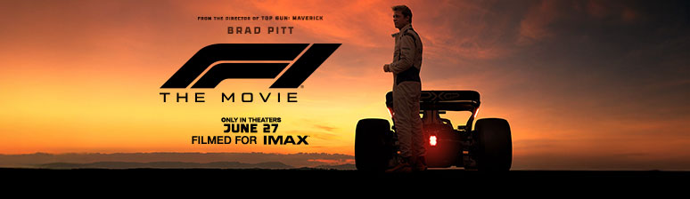

# 🏎️ MacOS Live Video Wallpaper

<div align="center">



**🎥 Transform YouTube videos into stunning live wallpapers with F1-inspired precision and speed!**

*From Monaco's streets to your desktop - experience the thrill of motion*

[](https://www.apple.com/macos/)
[](https://nodejs.org/)
[](LICENSE)
[](CONTRIBUTING.md)
[](https://github.com/satyajiit/MacOS-Live-Video-Wallpaper/stargazers)


</div>

---

## 🎬 **DEMO: SEE IT IN ACTION**

<div align="center">

**🏁 Watch the magic happen - From YouTube to Live Wallpaper in minutes!**

<video width="800" height="450" controls autoplay muted loop>
  <source src="https://raw.githubusercontent.com/satyajiit/MacOS-Live-Video-Wallpaper/main/img/demo.mp4" type="video/mp4">
  Your browser does not support the video tag. <a href="https://raw.githubusercontent.com/satyajiit/MacOS-Live-Video-Wallpaper/main/img/demo.mp4">Click here to download the demo video</a>.
</video>

*🎯 **Demo shows**: YouTube video download → HEVC conversion → Live wallpaper installation*

</div>

---

## 🏁 **LIGHTS OUT AND AWAY WE GO!**

Experience the adrenaline of Formula 1 right on your desktop! This production-ready tool transforms any YouTube video into a dynamic macOS wallpaper with the precision of a pit stop and the speed of a DRS overtake.

## 🚀 **POLE POSITION SETUP** (One Command!)

<div align="center">

### 🏆 **FASTEST LAP TO SETUP**

</div>

**For non-technical users:** Just run this one command and everything will be set up automatically:

```bash
curl -fsSL https://raw.githubusercontent.com/satyajiit/MacOS-Live-Video-Wallpaper/main/setup.sh | bash
```

**Or if you have the files locally:**

```bash
./setup.sh
```

**🏁 RACE RESULTS:** The script will:

- 📁 Clone repository (if running via curl) - *Track Setup*
- 🗑️ Remove existing directory (if present) - *Clean Slate*
- 🏎️ Install Homebrew (if needed) - *Pit Stop Ready*
- 🔧 Install git (if needed) - *Version Control*
- ⚡ Install Node.js (if needed) - *Engine Power*
- 🛠️ Install ffmpeg and yt-dlp - *Precision Tools*
- 📦 Install all dependencies - *Full Tank*
- 🎯 Create an easy launcher - *One-Click Start*
- 🔐 Seamless privilege management - *No Extra Passwords*
- 🚀 **Smart Interactive Mode** - *Automatically opens new terminal for proper input handling*

> **🎯 NEW: Smart Terminal Detection**
> When installed via curl, the setup automatically detects non-interactive mode and opens a new Terminal window for proper input handling. This ensures the YouTube URL prompt works perfectly every time!

## 🎯 **GRID POSITIONS** (Usage Options)

After setup, choose your racing line:

<div align="center">

| 🥇 **POLE POSITION** | 🥈 **FRONT ROW** | 🥉 **PODIUM FINISH** |
|:---:|:---:|:---:|
| **Double-click launcher** | **Terminal Command** | **npm Script** |
| `run-wallpaper-setter.sh` | `sudo node index.js` | `sudo npm start` |
| *Easiest for beginners* | *Classic approach* | *Developer friendly* |

</div>

## ✨ **THE RACING LINE** (What This Tool Does)

This championship-winning tool delivers a flawless pit stop experience for your wallpapers:

🏎️ **QUALIFYING LAP:** Downloads YouTube videos in optimal quality (4K preferred)
🔧 **PIT STOP PRECISION:** Converts to HEVC .mov with hardware acceleration
⚡ **DRS BOOST:** Optimizes for 4K 60fps with 10-bit color depth
🏁 **RACE STRATEGY:** Guides you through macOS wallpaper setup
🎯 **PODIUM FINISH:** Automatically installs in system directory
💾 **SAFETY CAR:** Creates backups before any changes

## 🚀 **TECHNICAL SPECIFICATIONS** (Features)

<div align="center">

### 🏆 **CHAMPIONSHIP FEATURES**

</div>

| Feature | Status | Description |
|:--------|:------:|:------------|
| 🎬 **YouTube Integration** | ✅ | Direct download from any YouTube URL |
| 🎯 **4K Ultra HD** | ✅ | Crystal clear 2160p quality support |
| 🤖 **AI Automation** | ✅ | Smart wallpaper detection & setup |
| ⚡ **HEVC Acceleration** | ✅ | Hardware-accelerated H.265 encoding |
| 💾 **Pit Stop Backup** | ✅ | Safe backup before any changes |
| 🔧 **System Integration** | ✅ | Seamless macOS integration |
| 📊 **Telemetry** | ✅ | Real-time progress tracking |
| 🛡️ **Race Control** | ✅ | Comprehensive error handling |
| 🎨 **Cockpit Display** | ✅ | Beautiful color-coded interface |

## 🔧 Manual Installation (Advanced Users)

If you prefer to install dependencies manually:

### Required Dependencies

1. **Node.js** (>= 14.0.0)
   ```bash
   # Check your Node.js version
   node --version
   ```

2. **yt-dlp** - YouTube video downloader
   ```bash
   # macOS (using Homebrew) - Recommended
   brew install yt-dlp
   ```

3. **ffmpeg** - Video processing and conversion
   ```bash
   # macOS (using Homebrew) - Recommended
   brew install ffmpeg
   ```

### System Requirements

- **macOS Sequoia 15.5** (tested and verified)
- **macOS 10.15+** (compatible, but Sequoia recommended)
- **Administrator privileges** (sudo) - Required for system directory access
- **Terminal access** - Command line interface required

### Manual Setup Steps

1. **Clone or download this repository**
   ```bash
   git clone https://github.com/satyajiit/MacOS-Live-Video-Wallpaper
   cd MacOS-Live-Video-Wallpaper
   ```

2. **Install Node.js dependencies**
   ```bash
   npm install
   ```

3. **Verify all dependencies are available**
   ```bash
   npm run check-deps
   ```

## 🎯 **RACE WEEKEND SCHEDULE** (Step-by-Step)

<div align="center">

### 🏁 **FROM PRACTICE TO PODIUM**

</div>

| Session | Action | Description |
|:--------|:-------|:------------|
| 🏎️ **Practice 1** | `./setup.sh` | *First time setup (one-time only)* |
| 🚀 **Practice 2** | Launch tool | *Double-click launcher or terminal* |
| 🎯 **Qualifying** | Enter YouTube URL | *Paste your favorite racing video* |
| ⏱️ **Formation Lap** | Wait for processing | *Download & conversion magic* |
| 🏁 **Race Start** | Follow guided setup | *System will guide you through* |
| 🎖️ **Podium** | Restart Mac | *See your live wallpaper in action!* |

**🏆 RACE NOTES:**
- If no wallpapers exist: Tool opens System Preferences for initial setup
- Multiple wallpapers: Choose which one to replace from the grid
- Always confirm before making changes - Safety first!

## 🔧 **PIT CREW COMMANDS**

<div align="center">

### ⚡ **QUICK FIXES & MAINTENANCE**

</div>

| Command | Purpose | When to Use |
|:--------|:--------|:------------|
| `npm run refresh-wallpaper` | 🔄 **Restart Engine** | *When wallpaper becomes static* |
| `npm run check-deps` | 🔍 **System Check** | *Verify all tools are working* |
| `./setup.sh` | 🏎️ **Full Service** | *Reinstall everything fresh* |

```bash
# 🔄 RESTART ENGINE (Fix static wallpaper)
npm run refresh-wallpaper

# 🔍 SYSTEM CHECK (Verify dependencies)
npm run check-deps

# 🏎️ FULL SERVICE (Complete reinstall)
./setup.sh
```

## 🏎️ **CIRCUIT GUIDE** (Supported Formats)

<div align="center">

### 🏁 **APPROVED RACING CIRCUITS**

*All YouTube URL formats welcome on the grid*

</div>

| Circuit Type | URL Format | Example |
|:-------------|:-----------|:--------|
| 🏎️ **Main Circuit** | `youtube.com/watch?v=` | *Classic YouTube links* |
| ⚡ **Short Circuit** | `youtu.be/` | *Shortened URLs* |
| 🔗 **Embed Track** | `youtube.com/embed/` | *Embedded videos* |
| 📺 **Legacy Track** | `youtube.com/v/` | *Older format support* |

### 🏆 **CHAMPIONSHIP EXAMPLES**

```bash
# 🏁 START YOUR ENGINES
sudo node index.js

# 🎯 PASTE ANY OF THESE RACING-INSPIRED URLS:
# 🏎️ F1 Monaco GP: https://www.youtube.com/watch?v=zEsbZSRtM7E
# 🌊 Ocean Waves: https://youtu.be/NATURE_VIDEO_ID
# 🌌 Space Journey: https://www.youtube.com/watch?v=SPACE_VIDEO_ID
# 🔥 Abstract Motion: https://www.youtube.com/embed/ABSTRACT_VIDEO_ID
```

## 📁 Output & File Management

### Downloaded Videos
- All videos are saved to the `outputs/` directory
- Files are named with format: `{title}_{quality}.{extension}`
- Original .mp4 files are automatically cleaned up after successful .mov conversion
- The tool skips re-downloading if .mov video already exists
- If only .mp4 exists, it will convert to .mov and clean up the original
- **File permissions are automatically fixed** when running with `sudo` to ensure easy deletion later

### File Permission Issues

If you encounter files that require `sudo` to delete (common when the app runs with elevated privileges), we provide
multiple solutions:

#### Quick Fix Options

```bash
# Option 1: Dedicated cleanup utility
node cleanup.js

# Option 2: Built-in cleanup command
node index.js --cleanup

# Option 3: NPM scripts
npm run cleanup
npm run fix-permissions
```

#### What the Cleanup Utility Does

The cleanup utility will:

- 🔍 **Scan** for `.mov` and `.mp4` files with permission issues
- 📂 **Check** both `outputs/` and `outputs/wallpaper_backups/` directories
- 🔧 **Fix** ownership and permissions to match your user account
- 🗑️ **Optionally delete** problematic files if you choose
- 📊 **Provide** detailed reports of all actions taken

#### Interactive Options

When you run the cleanup utility, you'll be presented with options:

1. **Fix permissions** - Makes files deletable without sudo (recommended)
2. **Delete files** - Permanently removes all problematic files
3. **Exit** - Leave files unchanged

#### Prevention

The application now automatically:

- ✅ Fixes permissions for newly created `.mov` files
- ✅ Fixes permissions for wallpaper backup files
- ✅ Uses proper ownership when running with `sudo`
- ✅ Provides better error handling for permission issues

### Video Processing Features
- **Automatic Duration Extension**: Videos shorter than 3 minutes are automatically extended by looping
- **4K Upscaling**: All videos are converted to 4K resolution (3840x2160) for optimal wallpaper quality
- **HEVC Encoding**: Uses efficient H.265 codec with hardware acceleration when available
- **60fps Optimization**: Forces 60fps for smooth wallpaper animation
- **Smart Quality Detection**: Warns about non-4K source videos and suggests better alternatives

### Wallpaper Backups
- Original wallpapers are backed up to `outputs/wallpaper_backups/`
- Backups include timestamp for easy identification
- You can restore backups manually if needed

## 🎬 Live Wallpaper Animation Issues

### Common Problem: Static Wallpaper After Screen Lock

**Issue**: Live wallpapers may become static (show only one frame) after unlocking from the lock screen. This is a known macOS behavior where the system pauses video playback and doesn't always resume it properly.

**Solution**: Use the built-in refresh utility:

```bash
# Quick fix - refresh the wallpaper system
npm run refresh-wallpaper

# For better results, run with sudo
sudo npm run refresh-wallpaper
```

### Prevention Tips

1. **Keep Mac Plugged In**: Power saving features can pause live wallpaper animation
2. **Disable Energy Saver**: Go to System Preferences > Energy Saver and adjust settings
3. **Regular Refresh**: Run the refresh utility periodically if the issue persists
4. **Restart When Needed**: A full restart always restores wallpaper animation

### What the Refresh Utility Does

The utility runs 5 different methods to restore wallpaper animation:

1. **Restarts the wallpaper daemon** (`com.apple.idleassetsd`)
2. **Forces desktop refresh** through system events
3. **Resets display settings** (restarts Dock and SystemUIServer)
4. **Forces wallpaper system reload** using multiple approaches
5. **Touches wallpaper files** to update modification times and trigger refresh

Most methods work without `sudo`, but running with `sudo` provides access to all methods for maximum effectiveness.

### Directory Structure

```
macos-live-wallpaper/
├── src/
│   ├── config.js           # Configuration and constants
│   ├── logger.js           # Clean, interactive logging system
│   ├── dependencies.js     # Environment and dependency checking
│   ├── utils.js            # Utility functions
│   ├── videoInfo.js        # Video information retrieval and analysis
│   ├── downloader.js       # Download and conversion functionality
│   └── wallpaperManager.js # macOS wallpaper automation system
├── outputs/
│   ├── [downloaded_videos] # Downloaded and converted videos
│   └── wallpaper_backups/  # Backup of original wallpapers
├── index.js                # Main entry point
├── package.json            # Project configuration
├── .gitignore             # Git ignore rules
└── README.md              # This file
```

## 🎨 How It Works

### The Magic Behind Live Wallpapers

macOS stores dynamic wallpapers in a special system directory:
```
/Library/Application Support/com.apple.idleassetsd/Customer/4KSDR240FPS/
```

This tool:
1. **Detects** when this directory is empty (needs setup)
2. **Guides** you to download a "trigger" wallpaper from System Preferences
3. **Handles multiple wallpapers** by showing a selection menu with file details
4. **Opens Finder** to help you identify which wallpaper is currently active
5. **Converts** using HEVC hardware acceleration for optimal performance and quality
6. **Optimizes** to 4K 60fps with 10-bit color depth for stunning wallpapers
7. **Replaces** the selected wallpaper file with your YouTube video
8. **Maintains** the exact same filename so macOS recognizes it

## 🎬 Video Optimization

The tool automatically optimizes videos for macOS live wallpapers:

### **HEVC Hardware Acceleration**
- **Primary**: Uses Apple VideoToolbox for hardware-accelerated HEVC encoding
- **Fallback**: Automatically switches to software encoding if hardware unavailable
- **Performance**: Significantly faster encoding on Apple Silicon and Intel Macs

### **Optimal Settings**
- **Codec**: HEVC (H.265) with Main10 profile for 10-bit color
- **Resolution**: Upscaled to 4K (3840x2160) for crisp display
- **Frame Rate**: 60fps for smooth motion
- **Bitrate**: 50 Mbps for high quality
- **Format**: QuickTime .mov with proper HEVC tags

### **Quality Features**
- **10-bit Color**: Enhanced color depth and gradients
- **High Bitrate**: Preserves detail and reduces compression artifacts
- **Lanczos Scaling**: High-quality upscaling algorithm
- **FastStart**: Optimized for quick playback startup

## ⚙️ Configuration

The application can be configured by modifying `src/config.js`:

- **Video Preferences**: Resolution limits, format preferences, FPS preferences
- **Audio Preferences**: Bitrate settings, format preferences
- **Download Settings**: Retry attempts, timeout, HEVC settings, target resolution/framerate
- **Wallpaper Settings**: System directories, backup locations, retry logic
- **Logging**: Log levels, colors, symbols

## 🛡️ Error Handling

The application includes comprehensive error handling:

- **Dependency Checks**: Validates all required tools are installed
- **URL Validation**: Ensures valid YouTube URLs
- **Permission Checks**: Verifies system directory access
- **Network Errors**: Handles connection issues with retry logic
- **File System**: Manages output directory creation and file conflicts
- **Wallpaper Detection**: Intelligent monitoring of wallpaper setup
- **Graceful Shutdown**: Properly handles interruption signals

## 🔧 **RACE CONTROL** (Troubleshooting)

<div align="center">

### 🚨 **INCIDENT RESPONSE TEAM**

*When things don't go according to the race plan*

</div>

### 🏁 **QUICK PIT STOP** (Universal Fix)

**🚀 Red Flag Restart:**
```bash
./setup.sh
```
*This will reinstall all dependencies and fix most common problems.*

---

### 🚨 **COMMON INCIDENTS**

| Issue | Severity | Solution | Notes |
|:------|:--------:|:---------|:------|
| 🔧 **Dependencies Missing** | 🔴 **Critical** | `./setup.sh` | *Most common issue* |
| 🔐 **Admin Privileges** | 🟡 **Warning** | `sudo node index.js` | *Required for system access* |
| 🎬 **Static Wallpaper** | 🟡 **Warning** | `npm run refresh-wallpaper` | *Known macOS behavior* |
| 📁 **File Permissions** | 🟠 **Caution** | `sudo chown $(whoami):staff outputs/*.mov` | *Auto-fixed with sudo* |
| 🛡️ **Directory Access** | 🔴 **Critical** | *Grant Full Disk Access* | *System Preferences required* |

### 🔧 **DETAILED SOLUTIONS**

**1. 🔧 Dependencies Missing** ⭐ *Most Common*
```bash
# 🏎️ FULL PIT STOP - Fixes everything automatically
./setup.sh
```

**2. 🔐 Administrator Privileges Required** ⭐ *Very Common*
```bash
# 🏁 RACE START - Always run with sudo
sudo node index.js
# Or use the launcher: run-wallpaper-setter.sh
```

**3. 🎬 Live Wallpaper Goes Static** ⭐ *Very Common*
```bash
# 🔄 ENGINE RESTART - Refresh the wallpaper system
npm run refresh-wallpaper
```
*This is a known macOS quirk where video playback pauses after screen lock*

**4. 🛡️ Cannot Access Wallpaper Directory**
- Navigate to: **System Preferences > Security & Privacy > Privacy > Full Disk Access**
- Add your Terminal application
- Restart Terminal and try again

5. **"Video unavailable"**
   - Video might be private, deleted, or region-locked
   - Try a different video URL
   - Some videos have download restrictions

6. **"Wallpaper not showing after restart"**
   - Ensure you selected the correct landscape wallpaper in System Preferences
   - Try selecting the wallpaper again in System Preferences > Wallpaper
   - Check that the .mov file exists in the Customer directory

7. **"Multiple wallpapers found"** (Selection Menu)
   - Tool will show a numbered list of all .mov/.mp4 files
   - Finder opens automatically to help you identify the current wallpaper
   - Check System Preferences > Wallpaper to see which one is active
   - Enter the corresponding number to select which wallpaper to replace

8. **"Quality warning for sub-4K video"**
   - This is normal for videos below 2160p resolution
   - The wallpaper will still work but may appear less sharp
   - Consider finding a higher quality version of the video

### Permission Issues

If you encounter permission errors:

1. **Grant Full Disk Access**:
   - System Preferences > Security & Privacy > Privacy > Full Disk Access
   - Add Terminal (or your terminal app)
   - Restart Terminal and try again

2. **Alternative approach**:
   ```bash
   # Run with sudo (use with caution)
   sudo node index.js "VIDEO_URL"
   ```

### Debug Mode

Set the log level to see more detailed information:
```bash
LOG_LEVEL=debug node index.js "VIDEO_URL"
```

## ⚠️ **RACE REGULATIONS** (Important Notes)

<div align="center">

### 🏁 **FIA TECHNICAL REGULATIONS**

*Safety first, speed second*

</div>

| Regulation | Status | Details |
|:-----------|:------:|:--------|
| 🍎 **macOS Only** | 🔴 **Mandatory** | *This tool only works on macOS systems* |
| 🏆 **Tested Platform** | ✅ **Verified** | *Fully tested on macOS Sequoia 15.5* |
| 🔐 **Sudo Required** | 🟡 **Required** | *Admin access needed for system directories* |
| 🛡️ **System Safety** | ⚠️ **Caution** | *Modifies system directories - use responsibly* |
| 💾 **Backup Protocol** | ✅ **Automatic** | *Tool creates backups automatically* |
| 🔄 **Restart Required** | 🔴 **Mandatory** | *Restart Mac to activate live wallpapers* |
| 🎯 **Quality Standard** | 🏆 **4K Preferred** | *Higher resolution = better experience* |
| 📁 **File Ownership** | ✅ **Protected** | *Proper user ownership maintained* |

## 🎯 Best Practices

1. **Use 4K videos** for optimal quality
2. **Choose shorter videos** (30-60 seconds) for better performance
3. **Test with simple videos** first before using complex content
4. **Keep backups** of your favorite wallpapers
5. **Restart after installation** to ensure proper activation

## 📄 **RACING LICENSE**

MIT License - see the LICENSE file for details.

*"If you no longer go for a gap that exists, you are no longer a racing driver."* - Ayrton Senna

## 🤝 **JOIN THE TEAM** (Contributing)

<div align="center">

### 🏎️ **BECOME A TEAM MEMBER**

*Help us build the fastest wallpaper setter in the paddock*

[](CONTRIBUTING.md)

</div>

We welcome contributions from developers of all skill levels! Whether you're fixing bugs, adding features, or improving documentation, every contribution helps make this tool better.

**🏁 Quick Start for Contributors:**

| Step | Action | Description |
|:-----|:-------|:------------|
| 🍴 **Fork** | Fork the repository | *Create your own racing team* |
| 🌿 **Branch** | Create feature branch | *Develop your racing strategy* |
| 🔧 **Develop** | Make your changes | *Engineer the perfect solution* |
| 🧪 **Test** | Test on macOS | *Ensure championship quality* |
| 🏁 **Submit** | Pull request | *Join the podium celebration* |

**📋 For detailed guidelines, code standards, and development setup, see our [Contributing Guide](CONTRIBUTING.md).**

---

<div align="center">

## 🏆 **CHAMPIONSHIP STANDINGS**

**🥇 Built with the precision of Formula 1 engineering**
**⚡ Powered by the speed of a DRS overtake**
**🎯 Designed with the accuracy of a perfect pit stop**

### 🏁 **"THAT'S P1! WHAT A DRIVE!"**

*Transform your desktop into a racing circuit*

[](https://github.com/satyajiit/MacOS-Live-Video-Wallpaper)
[](https://www.apple.com/macos/)

**🏎️ Ready to race? Start your engines with `./setup.sh`**

</div>

## 📋 Changelog

### v1.0.0 - macOS Live Wallpaper Setter
- Complete transformation from YouTube downloader to wallpaper setter
- Intelligent wallpaper detection and automation
- System Preferences integration
- Automatic .mov conversion for wallpaper compatibility
- Backup system for existing wallpapers
- Quality warnings for sub-4K videos
- Interactive guided setup process
- macOS-specific optimizations
- Comprehensive error handling for system operations
